# OmniCare Architecture Submission

**Project:** OmniCare
**Team:** Pulse Innovators

## 1. High-Level Architecture Diagram (Mermaid)

Copy the code below into [Mermaid Live Editor](https://mermaid.live/) for a high-resolution export.

```mermaid
graph TD
    %% Styling
    classDef client fill:#e1f5fe,stroke:#0277bd,stroke-width:2px,rx:10,ry:10;
    classDef gateway fill:#fff8e1,stroke:#ffb300,stroke-width:2px,rx:5,ry:5;
    classDef compute fill:#f3e5f5,stroke:#8e24aa,stroke-width:2px,rx:5,ry:5;
    classDef ai fill:#e8f5e9,stroke:#2e7d32,stroke-width:2px,rx:5,ry:5;
    classDef data fill:#e0f7fa,stroke:#006064,stroke-width:2px,rx:5,ry:5;
    classDef external fill:#eceff1,stroke:#546e7a,stroke-width:2px,rx:5,ry:5;

    subgraph Clients ["🚀 Client Interfaces (Frontend)"]
        PatWeb["💻 Patient Portal<br>(React + Vite)"]:::client
        DocWeb["💻 Doctor Portal<br>(React + Vite)"]:::client
        Mobile["📱 Paramedic App<br>(Offline-First PWA)"]:::client
        WA["💬 Patient WhatsApp<br>(Chat Interface)"]:::client
    end

    subgraph Network ["🌐 API Gateway Layer"]
        LB("⚖️ Load Balancer"):::gateway
        WS_Gate("⚡ WebSocket Gateway"):::gateway
    end

    subgraph Backend ["⚙️ OmniCare Core (Node.js)"]
        APIService["🔌 REST API Service<br>(Express.js)"]:::compute
        AuthService["🔐 Auth Service<br>(JWT & Role-Based)"]:::compute
        BlockService["🔗 Blockchain Ledger<br>(Drug Verification)"]:::compute
        RealTime["🚨 Emergency Service<br>(Socket.io)"]:::compute
    end

    subgraph AzureAI ["🧠 Microsoft Azure AI PaaS"]
        direction TB
        GPT["🔮 Azure OpenAI Service<br>(GPT-4o)<br>Feature: Smart Doctor & Triage"]:::ai
        Vision["👁️ Azure Computer Vision<br>Feature: Oncology & Dermatology"]:::ai
        Speech["🗣️ Azure Speech Services<br>(TTS / STT)<br>Feature: 3D Voice Avatar"]:::ai
        DocIntel["📄 Azure Doc Intelligence<br>Feature: Record OCR"]:::ai
        Trans["🌍 Azure Translator<br>Feature: Real-time Lang"]:::ai
    end

    subgraph DataLayer ["🗄️ Azure Data Persistence"]
        SQL[("🛢️ Azure Database for MySQL<br>(Patient Records, Appointments)")]:::data
        Blob[("☁️ Azure Blob Storage<br>(X-Rays, MRI Scans, Docs)")]:::data
        Redis[("🚀 Azure Cache for Redis<br>(Session State)")]:::data
    end

    subgraph External ["🔌 External Services"]
        Twilio["📱 Twilio API<br>(SMS / WhatsApp)"]:::external
        Maps["🗺️ Geolocation API<br>(Ambulance Tracking)"]:::external
    end

    %% Connections
    PatWeb -->|HTTPS / JSON| LB
    DocWeb -->|HTTPS / JSON| LB
    Mobile --> |Sync Data| LB
    WA --> |Webhook Msg| Twilio
    Twilio --> |POST /webhook| LB
    
    LB --> APIService
    PatWeb --> |Connect| WS_Gate
    DocWeb --> |Connect| WS_Gate
    WS_Gate --> RealTime

    %% Backend Logic
    APIService --> |Verify Token| AuthService
    APIService --> |Verify Drug Hash| BlockService
    
    %% AI Flows (Detailed)
    APIService --> |"Analyze Symptoms"| GPT
    APIService --> |"Scan Skin Lesion"| Vision
    APIService --> |"Voice Command"| Speech
    APIService --> |"Digitize Report"| DocIntel
    APIService --> |"Translate Chat"| Trans

    %% Data Flows
    APIService --> |CRUD Patient Data| SQL
    APIService --> |Upload/Fetch Images| Blob
    RealTime --> |Pub/Sub Live Location| Redis

    %% External Logic
    RealTime --> |Dispatch Coordinates| Maps
```

## 2. Detailed Technical Breakdown

**OmniCare** utilizes a **Hybrid Microservices Architecture** built entirely on the **Microsoft Azure Cloud**.

### A. Client Layer (Accessibility First)
*   **Patient Web Portal:** A comprehensive, responsive dashboard where patients can view their 3D Digital Twin, track medications, and book tele-consultations.
*   **Doctor Web Portal:** A specialized command center for doctors to manage schedules, view AI-summarized patient history, and analyze oncology scans.
*   **Paramedic App:** A **Capacitor-based Android App** with SQLite local storage. It functions 100% offline, syncing vital data to the cloud only when connectivity is restored ("Store-and-Forward" Architecture).
*   **WhatsApp Bot:** Uses **Twilio Webhooks** connected to our Azure backend to provide a zero-UI experience for users without access to the web portal.

### B. The AI Brain (Azure Cognitive Services)
*   **Azure OpenAI (GPT-4o):** Acts as the central reasoning engine. It powers the conversational logic for the Chatbot, performs Clinical Triage (Red/Yellow/Green flagging), and summarizes complex medical histories.
*   **Azure Computer Vision:** We utilize custom vision models to analyze medical imagery.
    *   *Dermatology:* Detects melanoma risk using Asymmetry and Color analysis.
    *   *Radiology:* Identifies anomalies in MRI scans for oncology support.
*   **Azure Speech Services:** Provides accessibility.
    *   *STT (Speech-to-Text):* Transcribes patient complaints in local dialects.
    *   *TTS (Text-to-Speech):* Powers the lip-syncing 3D Avatar for audio responses.
*   **Azure Document Intelligence:** An OCR pipeline that extracts structured key-value pairs (Patient Name, Dosage, Vitals) from photos of handwritten prescriptions.

### C. Secure & Scalable Data Layer
*   **Azure Database for MySQL:** The primary relational store for structured patient data, compliant with HIPAA/GDPR standards via Azure's built-in encryption.
*   **Azure Blob Storage:** Stores unstructured data like high-res X-Ray images and PDF reports.
*   **Custom Blockchain Ledger:** A Node.js-based immutable ledger. Every drug batch creates a hash (SHA-256) stored here, preventing database tampering and ensuring drug authenticity.

### D. Real-Time Emergency Layer
*   **Socket.io on Azure Web Apps:** Manages bi-directional WebSocket connections for live ambulance tracking. Risk alerts (e.g., "Heart Rate > 150") are pushed instantly to doctor dashboards without page refreshes.
